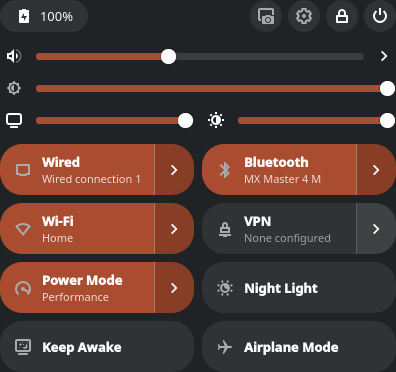
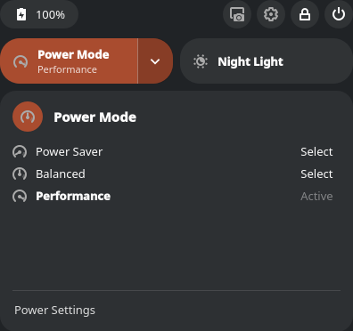

# Quick Settings for KDE Plasma

A GNOME-style quick settings panel for KDE Plasma 6: one popup with the toggles
and sliders that Plasma otherwise spreads across half a dozen tray icons.
It is a port of [quicksettings-mint](https://github.com/luciotorelli/quicksettings-mint),
the Cinnamon applet, and keeps its layout.



## What it does

- **Panel button** - battery icon and percentage. Scroll over it to change the screen brightness.
- **Header** - battery readout (opens the power settings), screenshot, System Settings, lock, shut down.
- **Sliders** - volume (click the icon to mute, the arrow lists output and input devices),
  one brightness slider per display, and contrast for DDC/CI monitors.
- **Pills** - Wired, Bluetooth, Wi-Fi, VPN (WireGuard included), Power Mode, Fan Curve,
  Night Light, Keep Awake, Airplane Mode. Click a pill to toggle it; the arrow opens a
  panel listing networks, devices, tunnels, profiles or fan strategies. The pill's row
  slides up under the header and the panel unfolds beneath it; long lists scroll.
- **Settings** - which pills and sliders to show, pill size and shape, accent colour,
  whether the pill or the arrow does the toggling, and the panel animation.



## How it differs from the Cinnamon applet

The Cinnamon version asks the system for its state by running `nmcli`, `bluetoothctl`
and `pactl` each time the popup opens. Here the state is live:

| | Backend |
|---|---|
| Wi-Fi, Wired, VPN, Airplane Mode | plasma-nm's models (`org.kde.plasma.networkmanagement`) |
| Bluetooth | BluezQt (`org.kde.bluezqt`) |
| Volume and devices | plasma-pa (`org.kde.plasma.private.volume`) |
| Brightness | `org.kde.ScreenBrightness` over D-Bus - laptop panel and DDC/CI monitors alike |
| Night Light | KWin's `NightLight` D-Bus interface to read, KWin's config to switch |
| Keep Awake | one PowerDevil inhibition (`PolicyAgent.AddInhibition`) |
| Power Mode | PowerDevil's `PowerProfile` D-Bus interface |
| Battery | UPower's `DisplayDevice` |
| Monitor contrast | `ddcutil` (Plasma has no contrast control) |
| Fan Curve | `fw-fanctrl` (Framework laptops) |

So there is no prefetching, caching or re-reading after an action: a pill's subtitle is
a binding, and the Wi-Fi list updates itself while it is open.

The network and audio modules are internal to Plasma. They are what Plasma's own applets
use and many third-party widgets rely on them, but a Plasma upgrade can change them. Each
backend is one file under `package/contents/ui/backends/` so that a break is a one-file fix.

## Requirements

- KDE Plasma 6, recent enough to ship the `org.kde.plasma.workspace.dbus` QML module
  (developed and tested on Plasma 6.7, Fedora 44).
- Optional: `ddcutil` for monitor contrast, `fw-fanctrl` for the Fan Curve pill.
  Without them those controls simply do not appear.

## Install

```bash
./install.sh
```

Then right-click the panel, choose **Add or Manage Widgets**, and add **Quick Settings**.
After upgrading, restart Plasma so it loads the new code:

```bash
systemctl --user restart plasma-plasmashell
```

To try it in a window without touching the panel:

```bash
plasmawindowed com.github.luciotorelli.quicksettings
```

## Development

`tools/grab.sh out.png` renders the popup to an image off-screen (Qt's offscreen platform),
so layout changes can be checked without installing anything or opening a window:

```bash
tools/grab.sh /tmp/qs.png                      # the popup as it opens
tools/grab.sh /tmp/qs.png qs-expand=wifi       # with a panel open
tools/grab.sh /tmp/qs.png qs-delay=14000       # wait for ddcutil before grabbing
tools/grab.sh /tmp/qs.png qs-check-config      # compile every settings page
tools/grab.sh /tmp/qs.png qs-expand=wifi qs-collapse qs-delay=2600   # open, then close again
tools/grab.sh /tmp/qs.png qs-expand=audio qs-switch=wifi qs-delay=2600   # one panel to another
tools/grab.sh docs/preview-main.png qs-demo    # placeholder Wi-Fi name, for public images
```

QML warnings land in the `.log` file next to the image. The hook behind this is
`DevGrab.qml`, which only loads when the process is started with a `qs-grab=` argument.

Two things learned the hard way:

- The popup window never changes size while it is open. A Plasma popup on a bottom panel
  has to be resized *and* moved to grow upwards, and on Wayland the move is applied before
  the taller contents arrive, so it visibly jumps up and drops back. Panels are therefore
  given room inside a fixed-size window instead (see `FullRepresentation.qml`).
- A QML trap: a property whose name starts with `on` followed by a capital (`onAccent`)
  is parsed as a signal handler and silently never gets its value.
